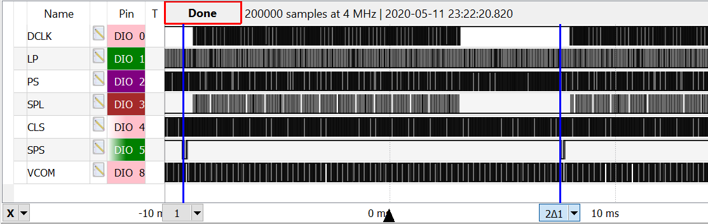
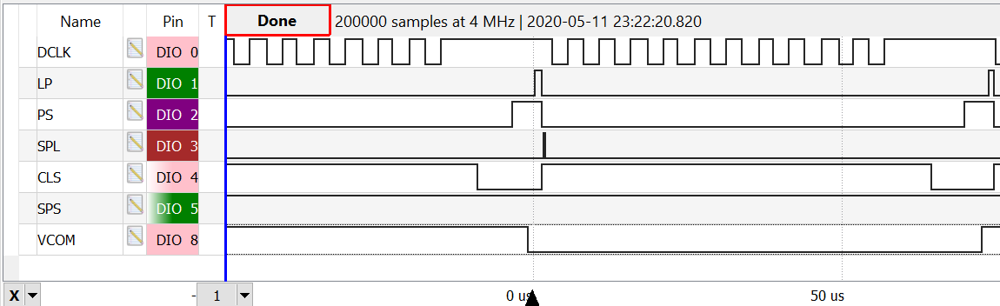
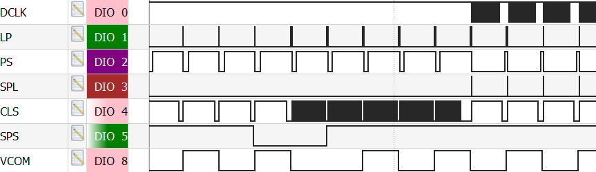

Game Boy Advance(GBA) LCD Interface
===================================

Manufactured by Sharp. 
Potential model numbers: *LQU29B2DDO2P 18H00862812* or *QPWBH2218TPZZ*. Data-sheets unavailable. 

# 40-Pin FFC Pinout
|Pin|Name|Description|Details|
|--- |--- |--- |--- |
|1|TST2|||
|2|VSHD|||
|3|DCLK|Pixel clock|Active on negative edge|
|4|LP|Data latch of signal source driver (i.e pixel clock)|Active on positive edge|
|5|PS|Power save signal|Active on positive edge|
|6|DGND|Digital ground||
|7|VSHD|||
|8|LDR5|Bit 4 of digital red||
|9|LDR4|Bit 3 of digital red||
|10|LDR3|Bit 2 of digital red||
|11|LDR2|Bit 1 of digital red||
|12|LDR1|Bit 0 of digital red||
|13|LDG5|Bit 4 of digital green||
|14|LDG4|Bit 3 of digital green||
|15|LDG3|Bit 2 of digital green||
|16|LDG2|Bit 1 of digital green||
|17|LDG1|Bit 0 of digital green||
|18|LDG0|Labeled as bit 0 of digital green, but tied to ground|GND|
|19|LDB5|Bit 4 of digital blue||
|20|LDB4|Bit 3 of digital blue||
|21|LDB3|Bit 2 of digital blue||
|22|LDB2|Bit 1 of digital blue||
|23|LDB1|Bit 0 of digital blue||
|24|SPL|Sampling start signal (HSYNC)|Active on positive edge|
|25|CLS|Clock signal of gate driver||
|26|SPS|Start signal of gate driver. f = 59.737Hz/ (i.e.  VSYNC)|Active on negative edge|
|27|TST|||
|28|MOD|Control signal of gate driver||
|29|VCOM|Common electrode driving signal|Active on positive edge|
|30|VEE|||
|31|VSS|||
|32|VCC|||
|33|-|||
|34|VSHA|||
|35|AGND|Analog ground||
|36|V4|Voltage provided by AGB-REG chip on 40-pin GBA models. Check service manual.|Vpp=3.00V at 6.81KHz|
|37|V3|Voltage provided by AGB-REG chip on 40-pin GBA models. Check service manual.|Vpp=2.32V at 6.81KHz|
|38|V2|Voltage provided by AGB-REG chip on 40-pin GBA models. Check service manual.||
|39|V1|Voltage provided by AGB-REG chip on 40-pin GBA models. Check service manual.|Vpp=3.72V at 6.81KHz|
|40|V0|Voltage provided by AGB-REG chip on 40-pin GBA models. Check service manual.|Vpp=3.60V at 6.81KHz|

# Signals Explained
The delta between the two cursors(neg edge of SPS) here is 16.743 ms, with a
frequency averaging 59.728Hz, i.e. the refresh rate of the GameBoy Advance,
indicating this is likely our VSYNC signal: 

  
Zooming in, we can see that LP, PS, and SPL are all pulses that are active on
the negative edge and each seem to represent the beginning of a pixel(each
negative edge of the DCLK signal represents 15-bits of RGB being read by the
display):

   
However, the PS signal is changed from a positive duty cycle of 85.699% to a
positive duty cycle of 6.498% during the VBLANK period(SPS pulse followed by
SPL pulse is the first pixel of the frame). This duty cycle change is shown
here:

# Resources
## Portuguese GBA internal service manual
Contains acronyms for most of the 40-pins present on the Game Boy. This was
super helpful when I was having trouble figuring out why my signals suddenly
made no sense(my FFC was upside-down).  
https://dragaosemchama.com/wp-content/uploads/2015/02/GBA-service-Manual.pdf

## AlexiG's blog post
Great explanation of some of the LCD interface's signals. Wish I had found this
sooner:  
https://www.insidegadgets.com/2019/08/08/playing-around-with-the-gba-lcd/

## Sharp LQ035Q7DH07 TFT-LCD Datasheet
An LCD datasheet from the same manufacturer as the GBA, although the LCD in the
datasheet was manufactured 5-6 years after the Game Boy Advance.  
https://www.mouser.com/datasheet/2/365/LQ035Q7DH07N_SPEC_LD-21910A-184021.pdf
